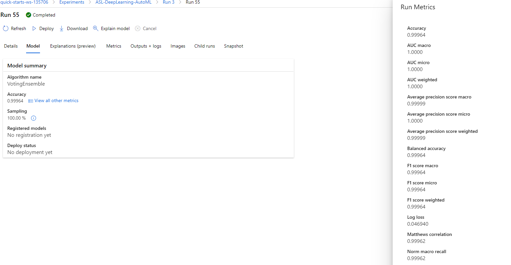
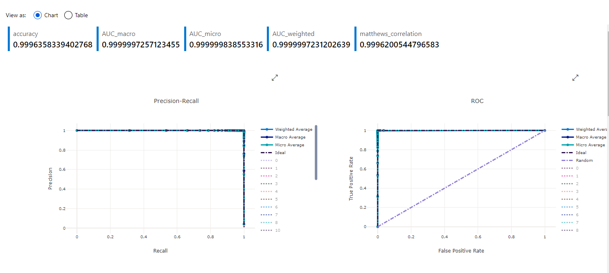
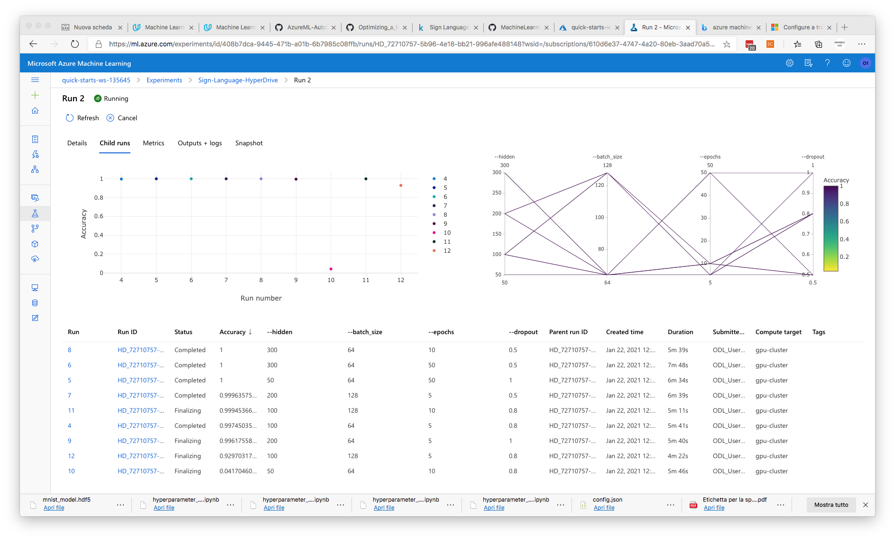

# American Sign Language Recognition with Deep Learning

Sign languages are a group a communication languages that use a combination of manual articulations in combination with non-manual elements to convey messages. There are different sign language with variability in hand shape, motion profile, and position of the hand, face, and body parts contributing to each sign. Each country generally has its own native sign language, and some have more than one: the current edition of [Ethnologue](https://www.ethnologue.com/subgroups/sign-language) lists 144 sign languages.

The simplest class of sign languages, know as fingerspelling systems is limited to a collection of manual sign that representing the symbol of an alphabet.

Sign language recognition and translation is one of the application areas of human computer interaction (HCI) where signs are recognized and then translated and converted to text or voice and at symbol, word or sentence level

In this demo project we are going to create two different models to accomplish the letter/number gesture recognition task from static image. For the first model we will use Azure Automated ML (_AutoML_ from now on) and then we will train a custom model whose hyperparameters are tuned using HyperDrive. Then we will compare the performance of both the models and we will deploy the best performing model as web service using Azure ML SDK.


All steps are described int this document and a screencast that shows the processs and the final working ML application is provided.

## Table Of Contents

- [American Sign Language Recognition with Deep Learning](#american-sign-language-recognition-with-deep-learning)
    - [The Sign Language Recognition Problem](#the-sign-language-recognition-problem)
  - [Table Of Contents](#table-of-contents)
  - [Project Workflow](#project-workflow)
  - [Project Set Up and Installation](#project-set-up-and-installation)
  - [Dataset](#dataset)
    - [Overview](#overview)
    - [Task](#task)
    - [Access](#access)
  - [Automated ML](#automated-ml)
    - [Results](#results)
  - [Hyperparameter Tuning](#hyperparameter-tuning)
    - [Results](#results-1)
  - [Model Deployment](#model-deployment)
  - [Screen Recording](#screen-recording)
  - [Standout Suggestions](#standout-suggestions)


## Project Set Up and Installation
To run this project you will neeed an Azure ML workspace.
The provided Jupyter notebboks can be executed in local development environment or inside Azure Machine Learning Studio.

In the local development enviroment with the following libraries installed:

- Numpy and Pandas — for data handling and processing
- PyTorch and Torchvision — for machine learning functions
- Matplotlib — for data visualization
- Azure ML SDK
- Azure ML widget extention installed (if notebook is executed from Visual Studio Code)


```
conda install numpy pytorch torchvision cpuonly -c pytorch -y
pip install matplotlib --upgrade --quiet
pip install azureml-sdk
pip install azureml-sdk[notebooks]
```

The custom model can also be trained running the notebbok inside AzureML workspace. 

## Dataset
The [American Sign Language MNIST Dataset from Kaggle](https://www.kaggle.com/datamunge/sign-language-mnist) is used for this project. A copy of the dataset 


### Overview

This dataset is in tabular format and is similar to the original MNIST dataset.

Each row in the csv file represents a label and a single 28x28 pixel greyscale image represented using 784 pixel values ranging from 0-255

The label in the dataset is a number ranging from 0-25 associated with its english letter equivalent (e.g. 0 = a)

There is no label correspondence to the letter J (9) and Z (25) due to the motion required to symbolize those letters. 

In total there are 27,455 training cases and 7,172 tests cases in this dataset.


### The Sign Language Recognition Task
The general sign language recognition problem  include three different tasks:

1. static o continuous letter/number gesture recognition (classification problem)
2. static or continuous single word recognition (classification problem)
3. sentence level sign language recognition (Natural Language Processing problem)

In this demo project we are going to create two different models to accomplish the letter/number gesture recognition task from static image. 


### Access
The MNIST Sing Language Dataset is in tabular format (like the original MNIST dataset). Each row in the csv file represents a label and a single 28x28 pixel greyscale image represented using 784 pixel values ranging from 0-255.

The workspace dataset has been created from the original CSV file using TabularDatasetFactory class and registerd into the workspace.

```python
key = "sign-language-mnist"
description_text = "sign Language MNIST"

datastore_path = "https://github.com/emanbuc/ASL-Recognition-Deep-Learning/raw/main/datasets/sign-language-mnist/sign_mnist_train/sign_mnist_train.csv"

ds = TabularDatasetFactory.from_delimited_files(path=datastore_path,header=True)       
ds = ds.register(workspace=ws,name=key,description=description_text)
df = ds.to_pandas_dataframe()
```

## Automated ML
The follwing AutoML settings was used for the experiment

```python
automl_settings = {

  "experiment_timeout_hours" : 1.1,

  "enable_early_stopping" : True,

  "iteration_timeout_minutes": 10,

  "max_concurrent_iterations": 10,

  "enable_onnx_compatible_models": True

}


automl_config = AutoMLConfig(

  debug_log='automl_errors.log',

  compute_target=gpu_cluster,

  task='classification',

  primary_metric='accuracy',

  training_data= ds,

  label_column_name='label',

  **automl_settings)
```

**max_concurrent_iterations** : 10

AmlCompute clusters support one interation running per node. For multiple AutoML experiment parent runs executed in parallel on a single AmlCompute cluster, the sum of the max_concurrent_iterations values for all experiments should be less than or equal to the maximum number of nodes. Otherwise, runs will be queued until nodes are available. Set to 10 as number of node in compute cluster.

**experiment_timeout_hours**: 1.1

Experiment must end before Lab timeout. Azure Machine Learning require  an experiment timeout greater than 1 hour  for the input dataset of this size. So the a value of 1.1 hour is used.

**iteration_timeout_minutes** : 10

Maximum time in minutes that each iteration can run for before it terminates. We are using a powerful GPU cluster to get fast iteration.   10 minutes limit has been set to avoid Lab timeout.

**enable_early_stopping**: true

Whether to enable early termination if the score is not improving in the short term after the first 20 iteration.. Set to True to avoid waste time. We don't need to try every possible iteration in this demo experiment and we must avoid the Lab timeout.

**enable_onnx_compatible_models**: True

Whether to enable or disable enforcing the ONNX-compatible models. Must be True to anable deploy on ONNX runtime.

### Results
*TODO*: What are the results you got with your automated ML model? What were the parameters of the model? How could you have improved it?

AutoML generated many different models with good performance . Some of them achive 100% accuracy scopre.


The best model is a "Voting Ensemble"







A copy of the best model is archivied in folder [models/AutoML05929722a48.zip]()

## Hyperparameter Tuning
*TODO*: What kind of model did you choose for this experiment and why? Give an overview of the types of parameters and their ranges used for the hyperparameter search


### Results
*TODO*: What are the results you got with your model? What were the parameters of the model? How could you have improved it?

After Hyperparameters tuning the trined model achive 100% accuracy



*TODO* Remeber to provide screenshots of the `RunDetails` widget as well as a screenshot of the best model trained with it's parameters.


## Model Deployment
*TODO*: Give an overview of the deployed model and instructions on how to query the endpoint with a sample input.

## Screen Recording
*TODO* Provide a link to a screen recording of the project in action. Remember that the screencast should demonstrate:
- A working model
- Demo of the deployed  model
- Demo of a sample request sent to the endpoint and its response

## Standout Suggestions
*TODO (Optional):* This is where you can provide information about any standout suggestions that you have attempted.

- Use [Dataset Monitor](https://docs.microsoft.com/en-us/azure/machine-learning/how-to-monitor-datasets?tabs=python) to detect data drift
- Publish a pipeline for automatic model re-training
- 

