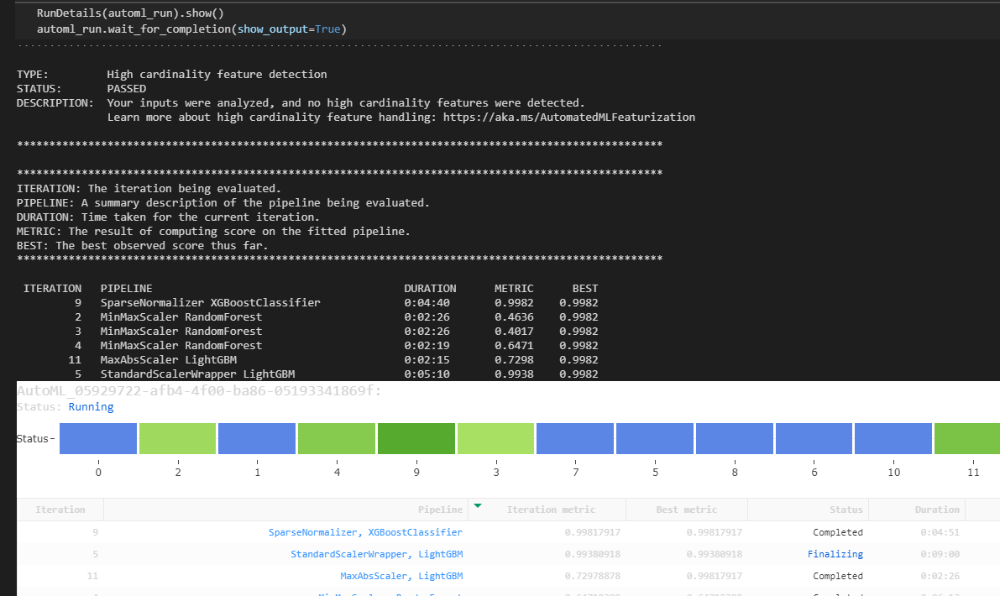
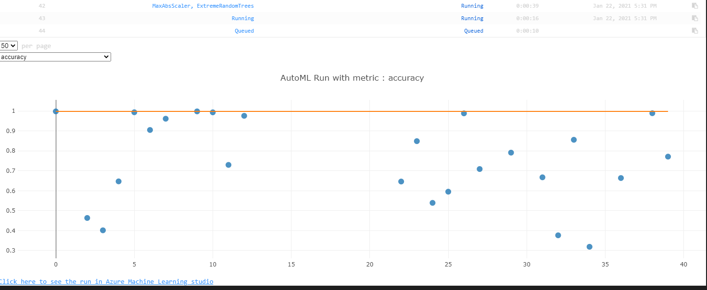
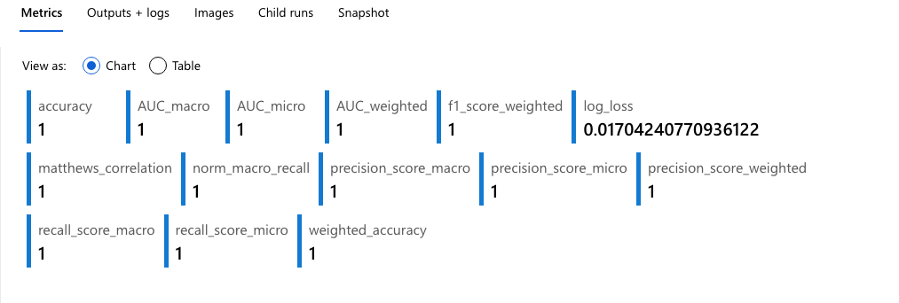
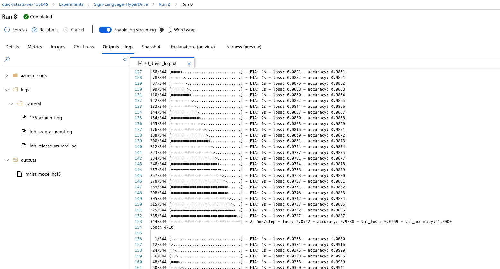
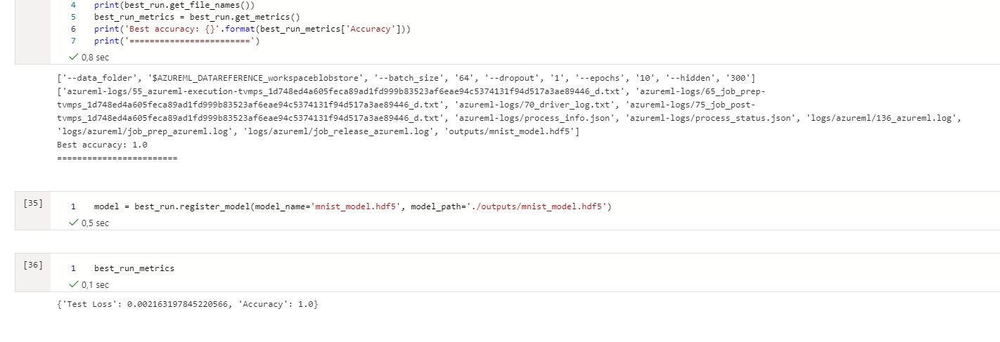
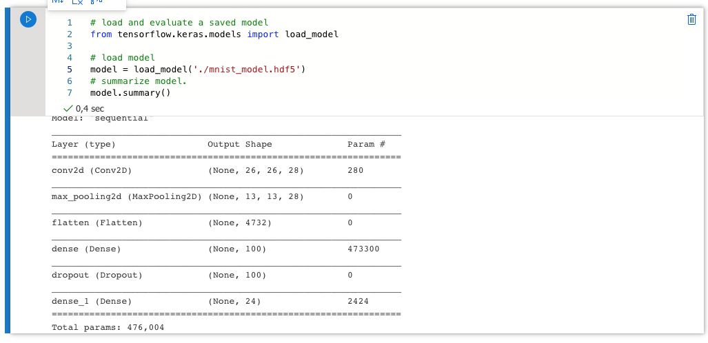
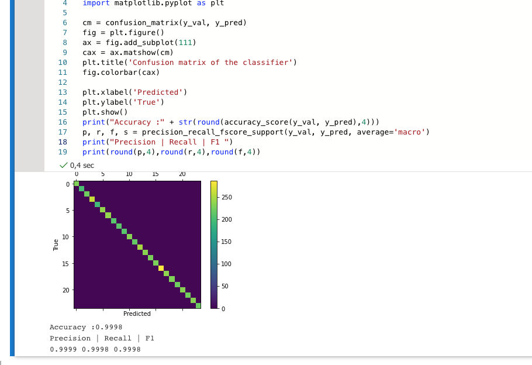
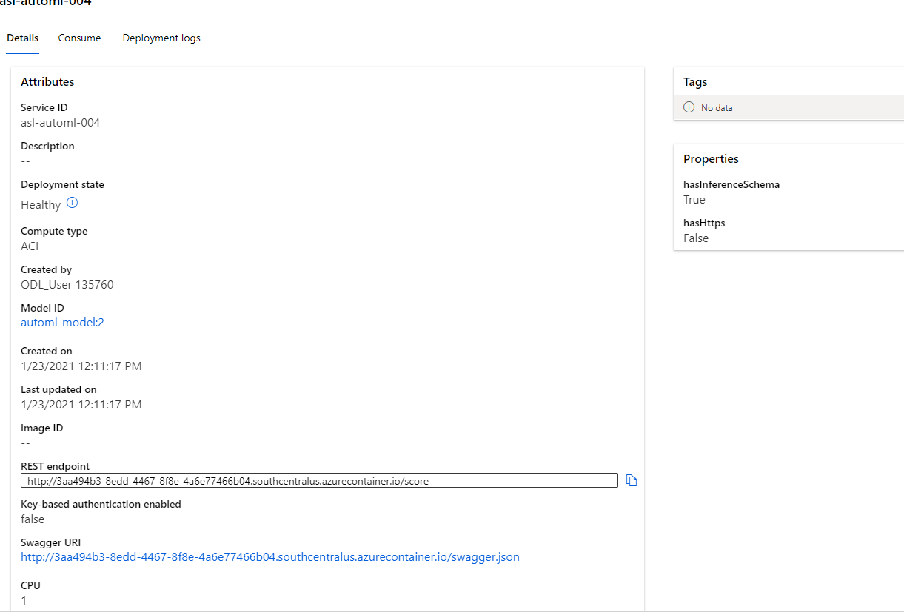
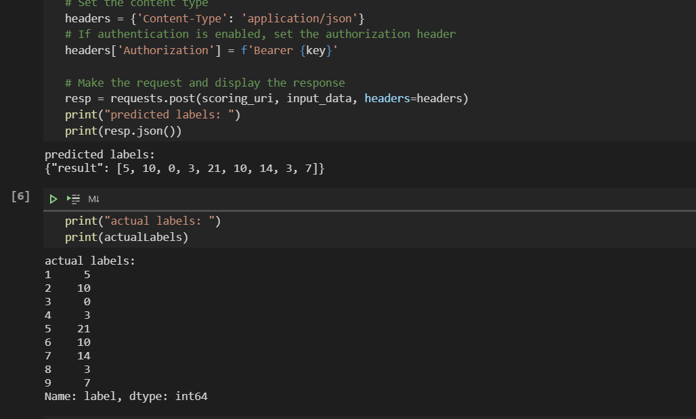

# American Sign Language Recognition with Deep Learning

Sign languages are a group a communication languages that use a combination of manual articulations in combination with non-manual elements to convey messages. There are different sign language with variability in hand shape, motion profile, and position of the hand, face, and body parts contributing to each sign. Each country generally has its own native sign language, and some have more than one: the current edition of [Ethnologue](https://www.ethnologue.com/subgroups/sign-language) lists 144 sign languages.

The simplest class of sign languages, know as fingerspelling systems is limited to a collection of manual sign that representing the symbol of an alphabet. In this project we are going to create two different models to accomplish the letter/number gesture recognition task from static images. 

For the first model we will use Azure Automated ML (_AutoML_). We will also develop and train a second custom model with Kera/Tensorflow framework whose hyperparameters are tuned using  _HyperDrive_ from _Azure Machine Learning_. Then we will compare the performance of both the models and we will deploy the best performing model as web service using Azure ML SDK.


All steps are described in this document. A screencast that shows the processs and the final working ML application is provided together with Jupyter notebooks, Python scripts and trained model. 

## Table Of Contents

- [American Sign Language Recognition with Deep Learning](#american-sign-language-recognition-with-deep-learning)
  - [Table Of Contents](#table-of-contents)
  - [Project Set Up and Installation](#project-set-up-and-installation)
    - [Run from Visual Studio Code](#run-from-visual-studio-code)
  - [Dataset](#dataset)
    - [Dataset format](#dataset-format)
    - [The Sign Language Recognition Task](#the-sign-language-recognition-task)
    - [Data Access](#data-access)
  - [Automated ML](#automated-ml)
    - [Results](#results)
  - [Hyperparameter Tuning](#hyperparameter-tuning)
    - [Model](#model)
    - [Hyperparameter  Config](#hyperparameter--config)
    - [Results](#results-1)
  - [Model Deployment](#model-deployment)
    - [How To Deploy the model](#how-to-deploy-the-model)
    - [Test the model](#test-the-model)
  - [Screen Recording](#screen-recording)
  - [Future Improvements](#future-improvements)


## Project Set Up and Installation
To run this project you will need an Azure ML workspace.
The provided Jupyter notebooks can be executed in local development environment with _AzureML SDK installed_ or uploaded in _Azure Machine Learning Studio_ and executed in a remote compute instance. For model training a remote compute cluster in _Azure ML_  is used.

The following libraries must be installed in the development environment:

- Numpy and Pandas — for data handling and processing
- SciKitLearn, TensorFlow , Kera— for machine learning functions
- Matplotlib — for data visualization
- Azure ML SDK

Run the following install get all required libraries:


```bash
pip install azureml-sdk
pip install azureml-sdk[notebooks]
pip install tensorflow
pip install keras
pip install matplotlib
```

###  Run from Visual Studio Code

To run the notebook from Visual Studio Code you can install the following extensions:

- Azure Machine Learning (ms-toolsai.vscode-ai)
- Jupyter (ms-toolsai.jupyter) 

## Dataset
The [American Sign Language MNIST Dataset from Kaggle](https://www.kaggle.com/datamunge/sign-language-mnist) is used for this project. A copy of the dataset is included into [Datasets](./datasets) folder of the the repository. The dataset is made by two distinct collection of gray scale image:

- **sign_mnist_train**: for model training and validation
- **sing_mnist_test**: for model testing. (Never used during model training, tuning and validation process)


### Dataset format

This dataset is in tabular format and is similar to the [original MNIST dataset](https://www.kaggle.com/avnishnish/mnist-original). Each row in the csv file has a label and 784 pixel values ranging from 0-255 rapresenting a single 28x28 pixel greyscale image.

The label in the dataset is a number ranging from 0-25 associated with its english letter equivalent (e.g. 0 = a, 1=b, 2=c, ...)

There is no label correspondence to the letter J (9) and Z (25) due to the motion required to symbolize those letters in the sign language. 

In total there are 27,455 training cases and 7,172 tests cases in this dataset.


### The Sign Language Recognition Task
The general sign language recognition problem  include three different tasks:

1. static o continuous letter/number gesture recognition (classification problem)
2. static or continuous single word recognition (classification problem)
3. sentence level sign language recognition (Natural Language Processing problem)

In this demo project we are going to create two different models to accomplish the letter/number gesture recognition task from static images. 


### Data Access
The dataset is uploaded into the the workspace creating a _tabular dataset_ from the original CSV file using _TabularDatasetFactory_ class and registered as  "sign-language-mnist".  Dataset is then converted to a _Pandas dataframe_ for every subsegment usage.

```python
found = False
key = "sign-language-mnist"
description_text = "sign Language MNIST"

if key in ws.datasets.keys(): 
    found = True
    ds = ws.datasets[key] 

if not found:
    from azureml.data.dataset_factory import TabularDatasetFactory
    datastore_path = "https://github.com/emanbuc/ASL-Recognition-Deep-Learning/raw/main/datasets/sign-language-mnist/sign_mnist_train/sign_mnist_train.csv"
    ds = TabularDatasetFactory.from_delimited_files(path=datastore_path,header=True)       
    #Register Dataset in Workspace
    ds = ds.register(workspace=ws,name=key,description=description_text)

df = ds.to_pandas_dataframe()
```

## Automated ML
The *AutoML* configuration has tuned in order to be compatible with the 2 hour timeout limit we have for lab activity duration. 

For the training dataset we are using the _AutoML_ requires an experiment timeout greater than 1 hour.  A 1.1 hour value was used together with *iteration_timeout_minutes* set to 10 and *enable_early_stopping* = true to control the duration of the experiment.

To assure that only models compatible with ONNY are used _enable_onnx_compatible_models_ is set to True .

```python
automl_settings = {

  "experiment_timeout_hours" : 1.1,

  "enable_early_stopping" : True,

  "iteration_timeout_minutes": 10,

  "max_concurrent_iterations": 10,

  "enable_onnx_compatible_models": True
}
```
_Accuracy_ (ratio of predictions that exactly match the true class labels) is selected as primary metric for model scoring and the a remote GPU _AmlCompute Cluster_ with 10 node is selected as computation target.  _AmlCompute clusters_ support one interation running per node so  "max_concurrent_iterations" is set to 10 to match the cluster capacity.

```python
 automl_config = AutoMLConfig(

  debug_log='automl_errors.log',

  compute_target=gpu_cluster,

  task='classification',

  primary_metric='accuracy',

  training_data= ds,

  label_column_name='label',

  **automl_settings) 
```

### Results
The AutoML run generated many different models with good performance. Some of them achieve 100% accuracy score. The progess of the AutoML run can monitored with _Rundetails_ Widget (both from web interface and from local SDK)







The best performing model is a simple "Logistic Regression"  with a 100% accuracy score. The [trained model](./models/AutoMLcd06aae969_run55.zip) is provided in the models folder. The full list of the model is shown as the run finished.  





## Hyperparameter Tuning
The custom model was created with Keras using CNN architecture frequntly used for deep learning image recognition task.  The model training take four input parameters that can be used for hyper-parameters tuning.

### Model

```python
input_shape = (28,28, 1) # 28*28 = 784

model = keras.Sequential()

model.add(Conv2D(28, kernel_size=(3,3), input_shape=input_shape))

model.add(MaxPooling2D(pool_size=(2, 2)))

model.add(Flatten()) # Flattening the 2D arrays for fully connected layers

model.add(Dense(args.hidden, activation=tf.nn.relu))

if args.dropout is not None and args.dropout<1:

  model.add(Dropout(args.dropout))

model.add(Dense(y_train.shape[1],activation=tf.nn.softmax))
```

### Hyperparameter  Config

For Hyperparameter experiment we have to stay into total 2 hours lab timeout limit so only a limited number of run was possible.

In order to assure a quick execution time the _choice_ sampling method is used. Also a A *MedianStoppingPolicy* is added as termination policy together with  *max_total_runs* limit of 50. A remote GPU *AmlCluster* with 10 node is used as compute target and the *max_concurrent_runs* parameter match the cluster capacity.

```python
param_sampling = RandomParameterSampling({

​     '--hidden': choice([50,100,200,300]),

​     '--batch_size': choice([64,128]), 

​     '--epochs': choice([3,5,10]),

​     '--dropout': choice([0.5,0.8,1])})
```

### Results

During the HyperDrive run many parameters configuration that achieve a 100% accuracy on validation dataset has been found.
The tuning process can be monitored with RunDetails widget


The best run has been retrived  get_best_run_by_primary_metric() function of HyperDrive API. 

```
best_run = hyperdrive_run.get_best_run_by_primary_metric()
```

Log file produced by the run can be get from HyperDrive experiment to see more details. 



Then the model file is then downloaded, registered and evaluated


Keras model summary and confusion matrix





## Model Deployment
The best model from one of the AutoML run is a simple "Logistic Regression" that achive 100% accuracy score. There are many other models from AutoML run and from hyperdrive runs with top performance score, but the logistic regression is by far the more simpler and light weight model among the top performer.

The trained model with scoring script [is provided in models folder](./models/AutoMLcd06aae969_run55.zip).

The (zipped) size of the xgboost model is over 30MB, a CNN model is about 17MB when the logistic regression model size is only 0.8MB.
Simple e lightweight models should be preferred if there are no performance penality. 

The robusteness of the model has been test with some test case from test dataset that are non be used during the trainig process. The 100% accuracy is confirmed also with test cases from test dataset.

### How To Deploy the model
To deploy a model as web service in Azure ML there a _InferenceConfig_ object must be created with runtime environment and scoring script.

```Python
# inference config
from azureml.core.environment import Environment
from azureml.core.model import InferenceConfig, Model


env = Environment.get(ws, "AzureML-AutoML").clone("my_env")

for pip_package in ["scikit-learn"]:
    env.python.conda_dependencies.add_pip_package(pip_package)

inference_config = InferenceConfig(entry_script='./deploy/scoring_file_v_1_0_0.py',
                                    environment=env)
```

With a InferenceConfig defined the model can be deployed in a local o remote compute target. The deploy process will create the web service endpoint.


```Python
from azureml.core.webservice import AciWebservice, AksWebservice, LocalWebservice
from azureml.core.model import InferenceConfig, Model

#For remote compute target
deployment_config = AciWebservice.deploy_configuration(cpu_cores = 1, memory_gb = 1)

#For local compute target
#deployment_config = LocalWebservice.deploy_configuration(port=8890)

from azureml.core.webservice import LocalWebservice, Webservice
service = Model.deploy(ws, "asl-automl-004", [model], inference_config, deployment_config)
service.wait_for_deployment(show_output = True)
print(service.state)
```
The deployment process can take some time (up to 10 minutes). When completed the service state is "Healty".



### Test the model
A deployed model can be test comsuming the public scoring endpoint. There are many test case available in the test dataset.

```
test_data = pd.read_csv("https://github.com/emanbuc/ASL-Recognition-Deep-Learning/raw/main/datasets/sign-language-mnist/sign_mnist_test.csv")

#Take the first 10 test case
X_test=test_data.iloc[1:9,1:785]
actualLabels= test_data.iloc[1:9,0]
```


Please note that the test data must be trasposed to match the model input format.

```
testdict= X_test.to_dict(orient="index")
inputList=(testdict[1],testdict[2],testdict[3],testdict[4],testdict[5],testdict[6],testdict[7],testdict[8],testdict[9])
```

Now we can send the test cases to the service in JSON format

```Python
data = {"data": inputList}
# Convert to JSON string
input_data = json.dumps(data)
```

```Python
scoring_uri = 'http://3aa494b3-8edd-4467-8f8e-4a6e77466b04.southcentralus.azurecontainer.io/score'
# If the service is authenticated, set the key or token
key = ''

# Set the content type
headers = {'Content-Type': 'application/json'}
# If authentication is enabled, set the authorization header
headers['Authorization'] = f'Bearer {key}'

# Make the request and display the response
resp = requests.post(scoring_uri, input_data, headers=headers)
print("predicted labels: ")
print(resp.json())
```

The prediction made by the deployd model was 100% accurate.




## Screen Recording
[Screen recording - https://youtu.be/PjK1L8Wxd0M](https://youtu.be/PjK1L8Wxd0M)

## Future Improvements
The model achive 100% on the training/test dataset, but do not generalize well with real world image.

A more "realistic" training dataset should be used in order to create a useful application
